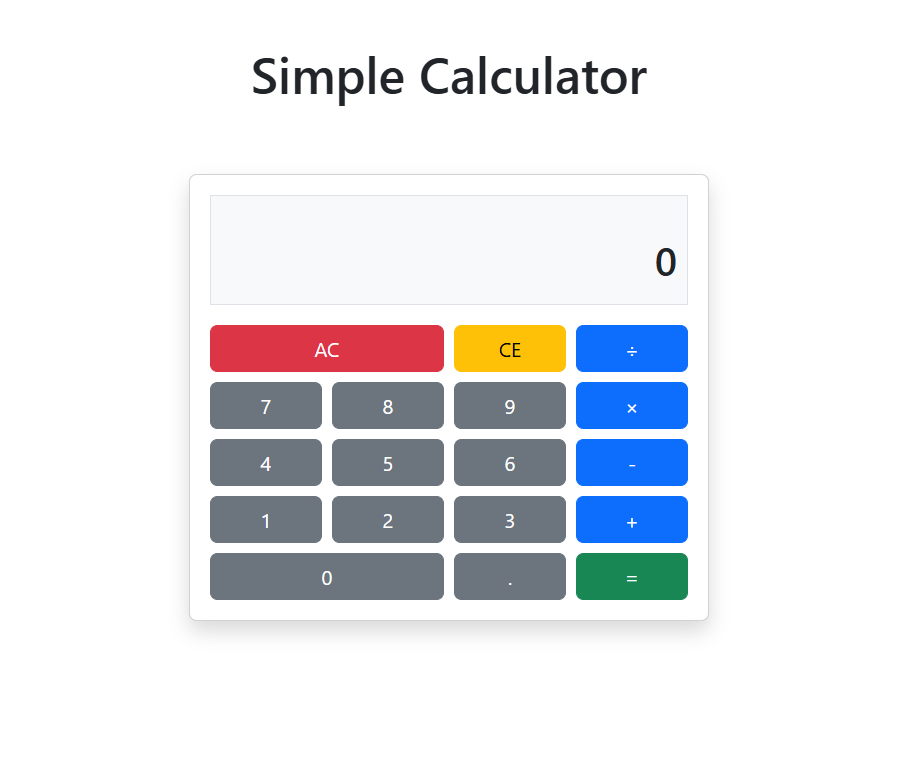

# React Calculator

A modern, responsive calculator web application built with React and Bootstrap, featuring a clean user interface and core arithmetic functionality.

## Features

- Basic arithmetic operations (addition, subtraction, multiplication, division)
- Responsive design that works across all device sizes
- Expression display showing the current calculation
- Clear All (AC) and Clear Entry (CE) functionality
- Decimal point support
- Chain calculation support

## Technologies Used

- React.js
- React Bootstrap
- CSS3
- 
## Usage

- Numbers (0-9): Input values
- Operations (+, -, ×, ÷): Select arithmetic operation
- Equal (=): Calculate the result
- AC: Clear all entries and start over
- CE: Delete the last digit entered
- Decimal (.): Add a decimal point (only one per number)

## How It Works

The calculator manages state using React hooks:

- `display`: Current visible value
- `expression`: Full expression being calculated
- `operator`: Current arithmetic operator
- `firstValue`: First operand value
- `waitingForSecondValue`: Flag for waiting on second operand input
- `calculationComplete`: Flag indicating calculation has been performed

The logic handles various scenarios including:
- Starting a new calculation after completing one
- Chaining multiple operations
- Properly updating the expression display
- Managing decimal point input

